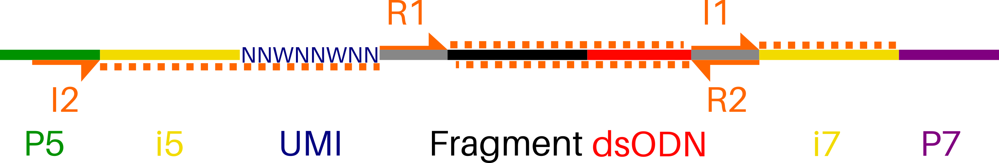

# GS-Preprocess
## Introduction 
GS-Preprocess is a simple, 5-argument pipeline that generates input data for the **GUIDEseq Bioconductor package** (https://doi.org/doi:10.18129/B9.bioc.GUIDEseq) from raw Illumina sequencer output. For off-target profiling, Bioconductor GUIDEseq only requires a 2-line **guideRNA fasta**, demultiplexed **BAM files** of "plus"- and "minus"-strands, and **Unique Molecular Index (UMI) references** for each read. The latter two are produced by GS-Preprocess.

Compatible libraries are constructed according to *GUIDE-seq enables genome-wide profiling of off-target cleavage by CRISPR-Cas nucleases* (https://doi.org/10.1038/nbt.3117).

## Set Up Sequencing Run
This pipeline is compatible with ***ANY SEQUENCER*** and requires ***NO PRE-CONFIGURATION*** of the illumina machine. This represents a  flexible alternative to https://github.com/aryeelab/guideseq#miseq which requires a pre-configured MiSeq and sample manifest YAML.

**Note:** Paired-end sequencing should include 8 Index1 (i7) cycles and **16** Index2 (i5) cycles:
	
	R1 | 8 | 16 | R2

###### adapted from Tsai et al. 2014

## Prerequisites
***Intended for use on computing clusters***
1. **≥50G of RAM allocated to the GS-Preprocess pipeline**

2. **Illumina output folder**: Download from BaseSpace or directly from any Illumina sequencer after run completion. No demultiplexing or fastq generation necessary!
	
		Run_output_dir_Example
		|-- Config
		|-- Data
		|-- Images
		|-- InterOp
		|-- Logs
		|-- RTAComplete.txt
		|-- RTAConfiguration.xml
		|-- RTALogs
		|-- RTARead1Complete.txt
		|-- RTARead2Complete.txt
		|-- RTARead3Complete.txt
		|-- RTARead4Complete.txt
		|-- Recipe
		|-- RunCompletionStatus.xml
		|-- RunInfo.xml
		|-- RunParameters.xml
		|-- Thumbnail_Images

     - **Illumina-format SampleSheet**: https://help.basespace.illumina.com/articles/descriptive/sample-sheet/ This sheet is in .csv format and is commonly used to demultiplex illumina .bcl files (raw sequencer output)

     - **RunInfo.xml**: Contains high-level run information,such as the number of Reads and cycles in the sequencing run. This file is standard output from any illumina sequencer and will automatically populate in any run output folder. *RunInfo.xml is found in the top-level output folder of any sequencing run*

3. **BWA Index Download**: https://support.illumina.com/sequencing/sequencing_software/igenome.html

## Dependencies
*Add the below dependencies:*

	bcl2fastq2/2.20.0
	python2
	R/3.6.0
	bwa/0.7.5a
	cutadapt/1.9
	gcc/8.1.0
	
Example:
>module add bcl2fastq2/2.20.0
## Download GS-Preprocess
In cluster working directory

	git clone https://github.com/umasstr/GS-Preprocess.git
## Workflow

## Prepare the Pipeline
Move into src directory

	cd GS-Preprocess/src
Make all files executable	

	chmod +x *
## Run the Pipeline
	./gs_preprocess.sh -t <number_of_threads> -o </absolute/path/to/output_directory> -r <directory_containing_RunInfo.xml> -s </path/to/SampleSheet.csv> -b </path/to/BWAIndex/genome.fa>

Completion of gs_preprocess.sh generates 2 of 3 inputs needed for Bioconductor GUIDEseq.
- [x] plus- and minus-strand BAMs
- [x] UMIs.txt
- [ ] guideRNA.fa
##guidrRNA fasta
Bioconductor GUIDEseq accepts a standard 20bp gRNA sequence in the fasta format.
1. Open any text editor
2. Enter in your gRNA name and sequence
3. Save this 2-line text file with a **.fa extension**

	>>*gRNA_or_gene_name*
	>GAGTCCGAGCAGAAGAAGAA
