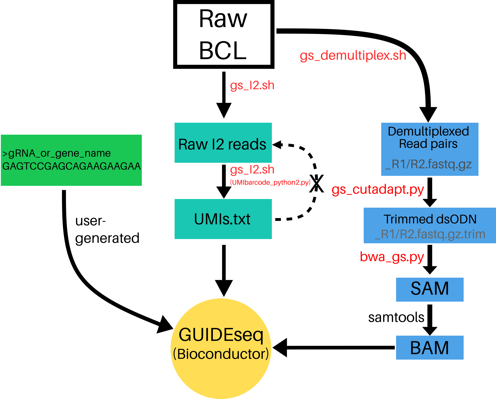

# GS-Preprocess
## Table of Contents
[Introduction](https://github.com/umasstr/GS-Preprocess#introduction)

[Getting Started](https://github.com/umasstr/GS-Preprocess#getting-started)
- [Set Up Sequencing Run](https://github.com/umasstr/GS-Preprocess#set-up-sequencing-run)
- [Prerequisites](https://github.com/umasstr/GS-Preprocess#prerequisites)
- [Dependencies](https://github.com/umasstr/GS-Preprocess#dependencies)
- [Download GS-Preprocess](https://github.com/umasstr/GS-Preprocess#download-gs-preprocess)
- [Prepare the Pipeline](https://github.com/umasstr/GS-Preprocess#prepare-the-pipeline)

[Run the Pipeline](https://github.com/umasstr/GS-Preprocess#run-the-pipeline)
- [Expected Runtime and Resource Usage](https://github.com/umasstr/GS-Preprocess#expected-runtime--resource-usage)

[Post GS-Preprocess Notes](https://github.com/umasstr/GS-Preprocess#post-gs-preprocess-notes)
- [gRNA fasta](https://github.com/umasstr/GS-Preprocess#guiderna-fasta)
- [Merging BAMs](https://github.com/umasstr/GS-Preprocess#merging-bams)
- [Sample Bioconductor GUIDEseq Input](https://github.com/umasstr/GS-Preprocess#sample-bioconductor-guideseq-input)
## Introduction 
GS-Preprocess is a simple, 5-argument pipeline that generates input data for the **GUIDEseq Bioconductor package** (https://doi.org/doi:10.18129/B9.bioc.GUIDEseq) from raw Illumina sequencer output. For off-target profiling, Bioconductor GUIDEseq only requires a 2-line **guideRNA fasta**, demultiplexed **BAM files** of "plus"- and "minus"-strands, and **Unique Molecular Index (UMI) references** for each read. The latter two are produced by GS-Preprocess.

Compatible libraries are constructed according to *GUIDE-seq enables genome-wide profiling of off-target cleavage by CRISPR-Cas nucleases* (https://doi.org/10.1038/nbt.3117).
## Getting Started
### Set Up Sequencing Run
This pipeline is compatible with ***ANY SEQUENCER*** and requires ***NO PRE-CONFIGURATION*** of the illumina machine. This represents a  flexible alternative to https://github.com/aryeelab/guideseq#miseq which requires a pre-configured MiSeq and sample manifest YAML.

**Note:** Paired-end sequencing should include 8 Index1 (i7) cycles and **16** Index2 (i5) cycles:
	
	R1 | 8 | 16 | R2

###### adapted from Tsai et al. 2014

### Prerequisites
***Intended for use on computing clusters***
1. **≥32G of RAM allocated to the GS-Preprocess pipeline**

2. **Illumina output folder**: Download from BaseSpace or directly from any Illumina sequencer after run completion. No demultiplexing or fastq generation necessary!
	
		Run_output_dir_Example
		|-- Config
		|-- Data
		|-- Images
		|-- InterOp
		|-- Logs
		|-- RTAComplete.txt
		|-- RTAConfiguration.xml
		|-- RTALogs
		|-- RTARead1Complete.txt
		|-- RTARead2Complete.txt
		|-- RTARead3Complete.txt
		|-- RTARead4Complete.txt
		|-- Recipe
		|-- RunCompletionStatus.xml
		|-- RunInfo.xml
		|-- RunParameters.xml
		|-- Thumbnail_Images

     - **Illumina-format SampleSheet**: https://help.basespace.illumina.com/articles/descriptive/sample-sheet/ This sheet is in .csv format and is commonly used to demultiplex illumina .bcl files (raw sequencer output)

     - **RunInfo.xml**: Contains high-level run information,such as the number of Reads and cycles in the sequencing run. This file is standard output from any illumina sequencer and will automatically populate in any run output folder. *RunInfo.xml is found in the top-level output folder of any sequencing run*

3. **BWA Index Download**: https://support.illumina.com/sequencing/sequencing_software/igenome.html

### Dependencies
*Add the below dependencies:*

	bcl2fastq2/2.20.0
	python2
	R/3.6.0
	bwa/0.7.5a
	cutadapt/1.9
	gcc/8.1.0
	
Example:
>module add bcl2fastq2/2.20.0
### Download GS-Preprocess
In cluster working directory

	git clone https://github.com/umasstr/GS-Preprocess.git

### Prepare the Pipeline
Move into src directory

	cd GS-Preprocess/src
Make all files executable	

	chmod +x *
##  Workflow

## Run the Pipeline
	./gs_preprocess.sh -t <number_of_threads> -o </absolute/path/to/output_directory> -r <directory_containing_RunInfo.xml> -s </path/to/SampleSheet.csv> -b </path/to/BWAIndex/genome.fa>

To avoid errors, use absolute paths. 

Completion of gs_preprocess.sh generates 2 of 3 inputs needed for Bioconductor GUIDEseq and stores them in working directory (GS-Preprocess/src/) 
- [x] plus- and minus-strand BAMs
- [x] UMIs.txt
- [ ] guideRNA.fa
### Expected Runtime & Resource Usage
Benchmarks for a 10 million read run with 40 uniquely barcoded samples (20 plus and minus strand):
	
- 8 cores, 48G RAM
	
		Total Runtime: 130 min
		CPU time: 23578.08 sec
		Max Memory: 12673 MB
		Average Memory: 4451.26 MB
		
- 24 cores, 48G RAM

		Total Runtime: 22 min
		CPU time: 11066.98 sec
		Max Memory: 12798 MB
		Average Memory: 2595.86 MB

- 32 cores, 48G RAM

		Total Runtime: 19 min
		CPU time: 11373.65 sec
		Max Memory: 12854 MB
		Average Memory: 2524.71 MB
## Post GS-Preprocess Notes
### guideRNA fasta
Bioconductor GUIDEseq accepts a standard 20bp gRNA sequence in the fasta format.
1. Open any text editor
2. Enter in your gRNA name and sequence
3. Save this 2-line text file with a **.fa extension**

		>gRNA_or_gene_name
		GAGTCCGAGCAGAAGAAGAA
### Merging BAMs
Certain situations will require user to merge BAM files:
1. A sequencer with multiple lanes (NEXTseq e.g.) will generate 4 fastq.gz files per sample labeled L001-L004. 
2. Replicate samples with distinct i5 and/or i7 barcodes. Different UMIs do not count as distinct barcodes for this purpose. 

To merge technical replicates, consider:

		samtools merge -@ <threads> <merged_sample_name.bam> <sample_1.bam> <sample_2.bam> ... <sample_n.bam>
		
To merge Lane 1-4 BAMs, consider:

		for i in *L001.bam;do samtools merge -@ <threads> ${i%_S*}.bam ${i%_S*}*.bam;done
### Sample Bioconductor GUIDEseq Input

		library(hash)
		library(GUIDEseq)
		library(BSgenome.Hsapiens.UCSC.hg38)
		library(TxDb.Hsapiens.UCSC.hg38.knownGene)
		library(org.Hs.eg.db)
		
		guideSeqResults <- GUIDEseqAnalysis(
		alignment.inputfile = c(POS_STRAND.bam,NEG_STRAND.BAM),
		umi.inputfile=c("UMIs.txt","UMIs.txt"),
		gRNA.file = gRNA_FILE.fa,
		max.mismatch = 10,
		BSgenomeName = Hsapiens,txdb = TxDb.Hsapiens.UCSC.hg38.knownGene,
		orgAnn = org.Hs.egSYMBOL,
		outputDir= SAMPLE_NAME,
		n.cores.max = NUMBER_THREADS)

